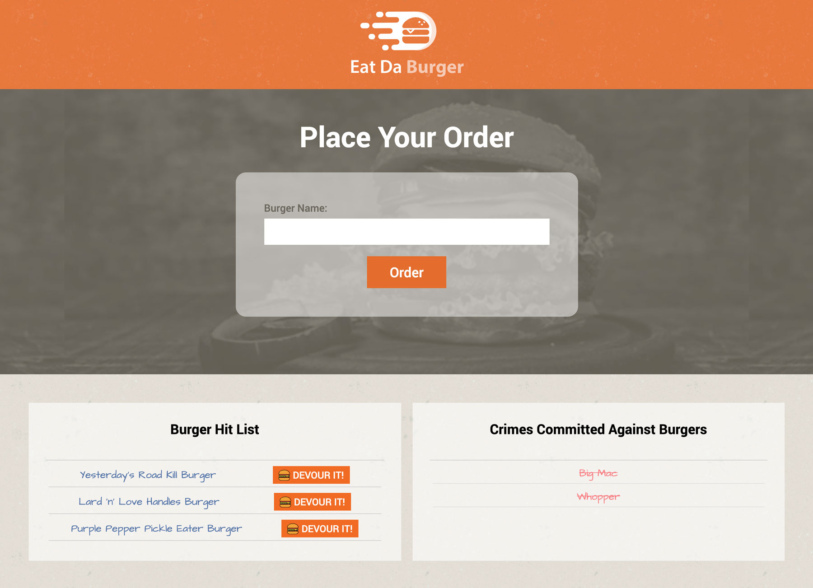

[](https://opensource.org/licenses/MIT)

# Eat Da Burger!

This is a simple application that allows the user to place an order for a burger and then "eat" it. This project was built on Node, Express, MySQL and Handlebars.

## Table of Contents

- [Site Link](#site-link)
- [License](#license)
- [Screenshots](#screenshots)
- [Contact](#contact)

## Site Link

1. Clone this repo

```sh
git clone git@github.com:rjwrightme/CLI-README-generator.git
```

2. cd into the repo and run

```sh
npm install
```

## License

Distributed under the MIT License. See `LICENSE` for more information.
[](https://opensource.org/licenses/MIT)

## Screenshots



## Contact

Have a burning question about this project? You can reach me at the following:

RJ Wright - rj@rjwright.me
[![twitter][twitter-shield]][twitter-url][![LinkedIn][linkedin-shield]][linkedin-url]

[linkedin-shield]: https://img.shields.io/badge/-LinkedIn-black.svg?style=flat-square&logo=linkedin&colorB=1178B3
[linkedin-url]: https://www.linkedin.com/in/rjwrightme/
[twitter-shield]: https://img.shields.io/badge/-Twitter-black.svg?style=flat-square&logo=twitter&logoColor=FFF&colorB=2AA3EF
[twitter-url]: https://twitter.com/rjwrightme
